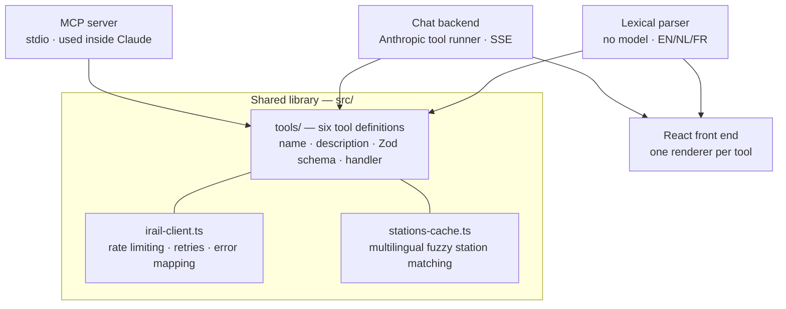

# NMBS MCP

Belgian train travel (NMBS/SNCB) as six composable tools, exposed through **three different front ends built on one shared library**: an MCP server that plugs into Claude, an LLM-powered chat web app, and a zero-cost search page that parses queries with hand-written rules instead of a model.

Live data comes from the community-run [iRail API](https://docs.irail.be/), which wraps the Belgian railway's own feeds.



The interesting constraint: **the same tool definitions feed both an MCP host and the Anthropic SDK's tool runner without modification**, because both want the same shape — a name, a description written for a model, a Zod schema, and a handler. The adapter between them is twenty lines.

---

## The three front ends

### 1. MCP server

Registers six tools over stdio for use inside Claude Code or Claude Desktop. The host supplies the model; this project supplies the tools.

### 2. Chat web app

A React app where you ask in plain language — *"I need to be in Bruges before 9 tomorrow, with my bike"* — and `claude-opus-5` orchestrates the tools. Responses stream over SSE, and each tool result renders as a purpose-built card (journey timeline, live board, carriage diagram) rather than as text.

In one real run, that question produced four tool calls and a reply naming the two carriages with bike spaces, plus a warning that the 5-minute change at Ghent was tight with a bicycle.

### 3. Direct search — no AI

The same six tools driven by a hand-written parser. No model, no API key, no cost, sub-second responses:

```
Leuven to Ghent tomorrow at 14:00     van Leuven naar Oostende
arrivées à Namur                      carriages of IC 513
berchem naar knokke morgen 14:00      storingen
```

It parses English, Dutch and French interchangeably — Belgians mix languages mid-sentence — and shows an interpretation line above every result so a misreading is visible rather than mysterious. Queries it cannot parse are never guessed at; it offers to hand them to the assistant instead.

Both web modes render identical cards, because direct mode calls the same tools and produces the same payloads.

---

## Tech stack

| Layer | Choice | Why |
|---|---|---|
| Language | TypeScript, `strict`, ESM | One type contract shared from the iRail response shapes through to the React props |
| Runtime | Node 18+ | Native `fetch`, `AbortSignal.timeout`, `process.loadEnvFile` — no polyfills |
| MCP | `@modelcontextprotocol/sdk` | stdio transport |
| LLM | `@anthropic-ai/sdk` — beta tool runner, streaming | Runs the agentic loop over client-side tools; SSE for token and tool-lifecycle events |
| Validation | Zod | One schema per tool serves MCP registration, SDK tool definition, and runtime validation |
| Backend | Hono + `@hono/node-server` | Small, typed, first-class SSE helper |
| Front end | React 19 + Vite 7 | Six result renderers and streaming state |
| Styling | Hand-written CSS with custom properties | Dark mode and responsive layout without a framework dependency |
| i18n | Custom, type-checked against the English bundle | A missing translation key is a compile error, not a silent English fallback |
| Dates | `Intl.DateTimeFormat` | Europe/Brussels handling and localised formatting with no date library |

Seven runtime dependencies in total, five of them unavoidable (the two SDKs, the server, and React). There is no date library, no fuzzy-search library and no CSS framework: each was replaceable with a small amount of code, and in the fuzzy-matching case the scoring needed domain-specific tuning that an off-the-shelf library would have fought.

---

## The six tools

| Tool | Purpose |
|---|---|
| `find_station(query, limit?)` | Fuzzy search across Dutch, French, English and German names. `Brussel-Zuid`, `Bruxelles-Midi` and `Brussels-South` all resolve to the same station. |
| `plan_journey(from, to, when?, arrive_by?)` | Journey planning with live delays, platforms, transfer times and service alerts. |
| `station_board(station, direction?, window_minutes?)` | Live departure or arrival board, windowed to the next N minutes. |
| `track_train(train_id, date?)` | Stop-by-stop progress of one train, with per-stop delays and platform changes. |
| `check_disruptions(lang?, limit?)` | Current and planned network disruptions. |
| `train_composition(train_id)` | Physical makeup of a train: carriages in order, seats per class, toilets, bike and reduced-mobility sections. |

**Input conventions.** Stations accept a fuzzy name or an id (`BE.NMBS.008813003`). Times accept `"now"` or ISO-8601 in Belgian local time. Train ids accept `IC513` or `BE.NMBS.IC513`.

---

## Engineering decisions worth explaining

**Strictness as an interface design.** `plan_journey` deliberately refuses natural-language dates. That looks like a limitation in isolation, but with a model in front it is correct: the LLM converts *"before 9 tomorrow"* into `when: "2026-09-17T09:00", arrive_by: true`, and the tool stays deterministic and testable. The lexical parser does the same conversion with rules. Neither consumer needs the tool to guess.

**Ambiguity is a result, not an error.** Six stations serve Brussels and locals distinguish them, so `plan_journey("Brussel", …)` returns a candidate list rather than picking one. The model can ask a follow-up; the web UI renders a picker. Both paths share one resolution rule so they agree on what counts as ambiguous.

**Resolving an ambiguity must not destroy the query.** An early version re-ran the picked station name as a fresh query, so answering *"which Berchem?"* turned `berchem naar knokke morgen 14:00` into a plain departure board — the destination and time were silently lost. The fix avoids string surgery on user input: the response names which *field* was ambiguous, and the client re-sends the original sentence with a station id pinned to that field. Answers accumulate, so a sentence ambiguous at both ends resolves one end without forgetting the other.

**iRail returns station names only in the requested language.** Matching "Bruxelles-Midi" against a Dutch-language station list fails outright. The cache fetches all four language lists at startup and merges them into an alias index per station, so a query matches regardless of the language it was typed in, while display still follows the user's choice.

**Prefix scoring favours short names, which is exactly wrong for a rail network.** `Gent` scored *higher* against `Gentbrugge` (a small suburban stop) than against `Gent-Sint-Pieters` (the main station), because the shorter name gives a better length ratio. A curated table of principal stations fixes the cities where everyday speech means one specific station. Brussels is deliberately excluded from that table.

**One rate-limit budget for the whole process.** iRail allows ~3 requests/second. A token bucket lives on a single shared `IrailClient`, and every consumer — MCP, chat, direct search, all browser sessions — draws from it. Constructing a client per language or per request would have quietly multiplied the limit.

**Retry only what is worth retrying.** Gateway errors (502/503/504) and network failures retry twice with backoff, because they clear immediately in practice. A 400 or 404 is the true answer to the question and retrying it only adds latency.

---

## Testing

Three suites, each matched to what it can actually prove:

```bash
npm run parse-test    # 38 table-driven parser cases across EN/NL/FR — offline, deterministic
npm run retry-test    # retry policy against a local stub server — no network
npm run manual-test   # 13 live checks of all six tools against the real iRail API
npm run typecheck     # tsc --noEmit over both the Node code and the web app
```

`parse-test` is the one that earned its keep: it started at 12 failures, and every one was a real bug. It now guards the specific traps that caused them — a time like `14u30` being read as train number 30, `Gent` resolving to the wrong station, and the station `Ede` matching inside the Dutch word `goede` because scoring used raw substring containment rather than word boundaries.

`manual-test` runs against live data, so it selects a train from a real departure board rather than hardcoding a train number. It also tolerates iRail listing a train on a board while having no journey record for it — which happens, and is upstream data rather than a bug here.

---

## Running it

```bash
npm install
npm run build
```

**As an MCP server** — a project-scoped [`.mcp.json`](.mcp.json) is included, so opening this directory in Claude Code offers the server directly. To register it globally instead, use an absolute path:

```json
{
  "mcpServers": {
    "nmbs": { "command": "node", "args": ["/absolute/path/to/dist/index.js"] }
  }
}
```

**As a web app** — direct search needs no API key; only the assistant does:

```bash
echo ANTHROPIC_API_KEY=sk-ant-... > .env   # gitignored
npm run dev:server    # http://localhost:8787
npm run dev:web       # http://localhost:5173
```

Open `?mode=direct` to skip straight to the no-AI page, or `?demo` (dev only) to see every card rendered from captured iRail data without spending tokens.

For production, `npm run build && npm run build:web && npm run start:web` serves the API and the built app from one process.

If the Anthropic API answers `400 … must include the anthropic-workspace-id header`, the key is org-level rather than workspace-scoped: either create a workspace-scoped key, or add `ANTHROPIC_WORKSPACE_ID=<id>` to `.env`.

---

## Known limitations

- iRail holds board, tracking and composition data only for dates close to today.
- NMBS publishes composition data for part of the fleet only, usually near departure. `train_composition` says so explicitly rather than erroring.
- iRail is an unofficial community API with no SLA. Failures surface as structured errors carrying a `kind` (`not_found`, `rate_limited`, `network_error`, …) rather than as exceptions.
- Session history for the chat app is in-memory and per-process — deliberate for a single-user local app, and the obvious first change for a multi-user deployment.
